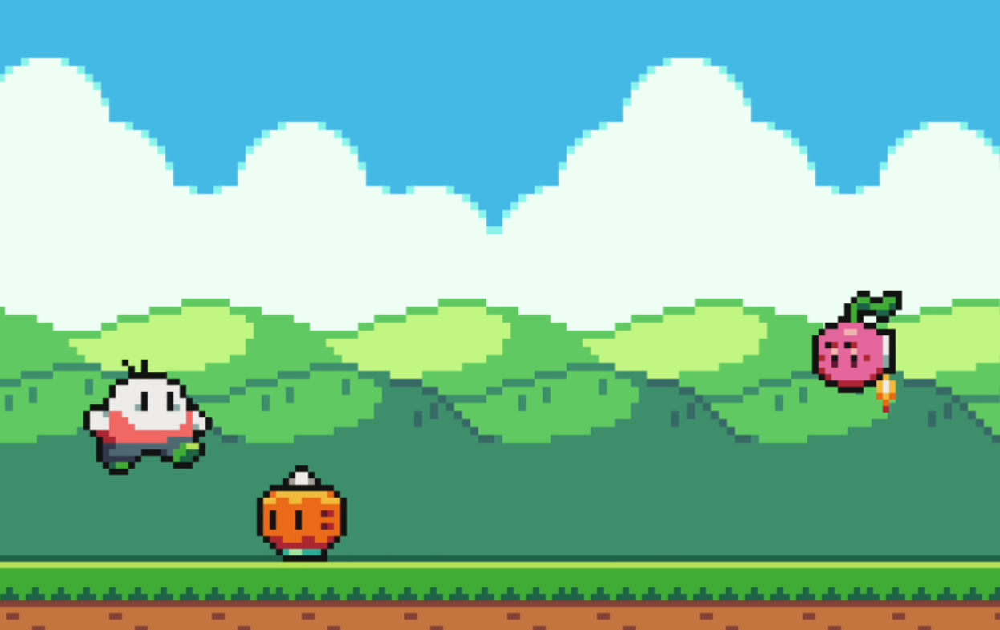

<h3 align="center">Onion Runner is a 2D side-scrolling runner game!</h3>

  Run as far as you can without getting caught by other troublesome produce!  
  How far can <i>you</i> get?

  </img>

## Roadmap

- [x] Player
  - [x] Movement and animation
  - [x] Collision detection
- [x] Enemy
  - [x] Movement and animation
  - [x] Sprite variety
- [] Audio
  - [] Background music
  - [] Sound effects
- [] Game Mechanics
  - [] Score system
  - [] Main menu
  - [] Pause menu
  - [] Scaling difficulty

## Credits

Inspired by [Clear Code](https://www.youtube.com/watch?v=AY9MnQ4x3zk)  
Art by [GrafxKid](https://opengameart.org/content/arcade-platformer-assets)  
Music by [@wyver9](https://opengameart.org/content/good-mood-theme-8-bit)
